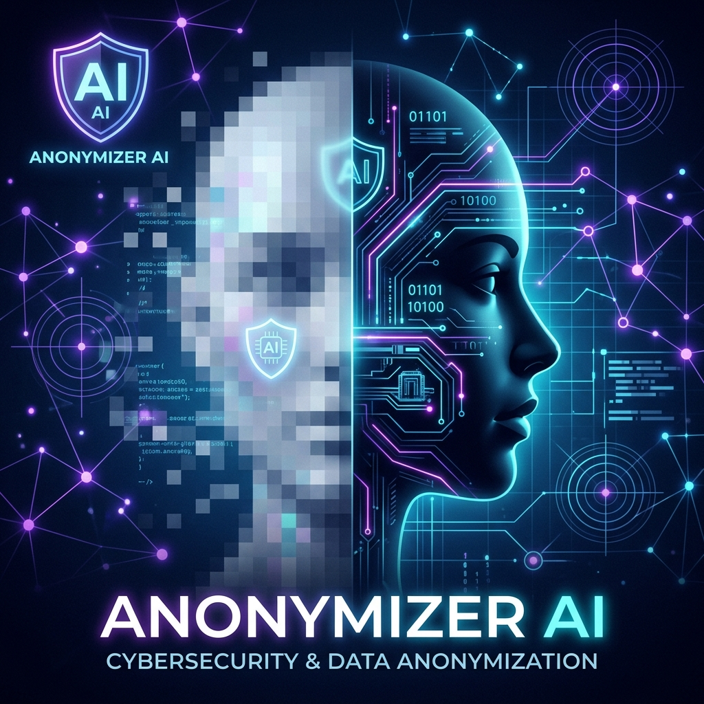
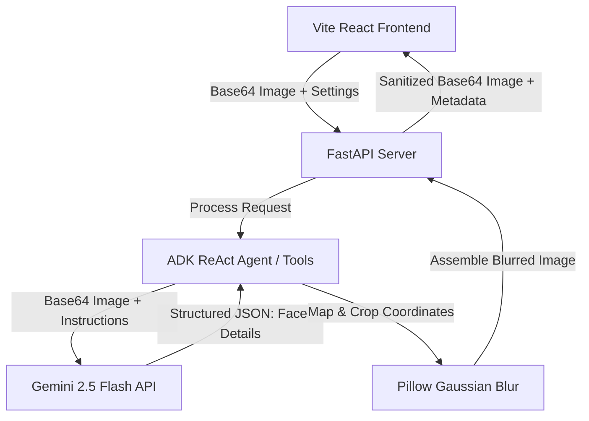

# Anonymizer AI: Intelligent Face Blurring Privacy Shield

### **A Hybrid AI & Interactive Canvas Approach to Image Anonymization and Child Privacy Protection**



---

## 📌 Competition Track
**Category:** **Agents for Good** (Privacy preservation, child safety online, data sanitization)

---

## 🎥 Video Demonstration

> [!TIP]
> Watch the video demonstration of **Anonymizer AI** in action:
> 🎬 **[Watch the Demo Video on YouTube](YOUR_PUBLIC_VIDEO_LINK_HERE)**
>
> *(The video demonstrates the complete user journey: uploading a photo, using the Auto AI detection mode with targeted child blurring, drawing custom elliptical stencils, toggling the before/after comparison slider, and downloading the sanitized output.)*

---

## 📖 Executive Summary
In the era of social media and ubiquitous camera sharing, online privacy is increasingly under threat. Uploading photos of family outings, classrooms, or public events often inadvertently exposes the faces of bystanders—particularly minors—without their consent. Fully automatic AI blurring solutions are convenient but frequently miss faces due to poor lighting or angles, or they over-censor by blurring adults unnecessarily. Manual tools, on the other hand, are slow and tedious.

**Anonymizer AI** solves this dilemma by introducing a **hybrid, human-in-the-loop agentic workflow**. It leverages **Gemini 2.5 Flash** for high-precision face detection and age estimation, coupled with a high-performance **React drag-and-draw canvas** that allows users to manually fine-tune the results, choose custom blurring stencils (rectangles or ellipses), and selectively blur only children. 

All core pixel-level blurring operations are handled locally on a secure FastAPI backend using Pillow, ensuring that user photos are sanitized before they are ever saved or shared.

---

## ✨ Key Features & User Experience

Anonymizer AI's frontend is built with a premium glassmorphic visual aesthetic and provides a rich, responsive workspace:

1. **Auto (AI-Powered) Mode:** Automatically detects human faces in a photo and estimates their age using the Gemini API.
2. **Targeted Child Protection Toggle:** A smart filter that permits blurring *only* minors (estimated age under 18), leaving adult faces untouched.
3. **Manual Canvas Editor:** Users can click and drag directly on the canvas to define custom regions of interest to blur (useful for license plates, documents, or missed faces).
4. **Custom Blur Stencils:** Switch dynamically between **Oval** (ellipse) and **Square** (rectangular) blurring segments on the canvas.
5. **Interactive Selection Deletion:** A trash icon overlay appears on all face bounding boxes (both AI-detected and manually drawn), allowing users to easily delete any stencil before applying changes.
6. **Interactive Before/After Slider:** An overlay slider allows users to compare the original image side-by-side with the blurred preview before download.
7. **Confetti Celebration:** A visual reward triggers upon successfully downloading the sanitized image.

---

## 🏗️ System Architecture

The application is structured into a lightweight, high-performance client-server setup:



### **1. The Frontend (Client)**
* **Stack:** React 18, TypeScript, Vite, Tailwind CSS.
* **Canvas Engine:** Interactive HTML5 Canvas overlay for drawing stencils, rendering bounding boxes, and managing manual boxes.
* **State Management:** Local React state with visual transitions, sliders, and progress indicators.

### **2. The Backend (Server)**
* **Stack:** FastAPI, Python 3.11+, `uv` package manager.
* **Integration Layer:** Built with the **Google Agent Development Kit (ADK)**, utilizing standard telemetry and logging wrappers.
* **Processing:** Pillow (PIL) for crop, Gaussian Blur filter, and ellipse stencil mask composting.

---

## 🛠️ Code Deep Dive & Implementation

### **1. Structured Bounding Boxes with Pydantic**
To get clean, programmatic outputs from Gemini 2.5 Flash, the agent uses Pydantic schemas to enforce a strict JSON structure for the returned face list:

```python
class FaceDetection(BaseModel):
    box_2d: List[int] = Field(description="Bounding box [ymin, xmin, ymax, xmax] normalized on a 0 to 1000 scale.")
    age: int = Field(description="Estimated age in years.")
    is_child: bool = Field(description="Whether the person is under 18 years old.")

class FaceList(BaseModel):
    faces: List[FaceDetection]
```

### **2. Calling Gemini with Structured Outputs**
The agent client utilizes `response_mime_type` and `response_schema` to query the model and immediately get parsed faces:

```python
client = get_genai_client()
image_part = types.Part.from_bytes(data=png_bytes, mime_type="image/png")

prompt = (
    "Locate all human faces in this image. For each face, return its bounding box coordinates "
    "normalized as [ymin, xmin, ymax, xmax] on a 0-1000 scale, its estimated age, and whether "
    "they are a child under 18 (true/false)."
)

response = client.models.generate_content(
    model="gemini-2.5-flash",
    contents=[image_part, prompt],
    config=types.GenerateContentConfig(
        response_mime_type="application/json",
        response_schema=FaceList,
    )
)
```

### **3. Pixel-Mapping & Local Gaussian Blurring**
Once coordinates are retrieved, they are mapped from the normalized 0-1000 scale back to actual image pixel dimensions, cropped, and blurred using Pillow's `GaussianBlur`:

```python
# Map normalized coordinates back to pixels
ymin, xmin, ymax, xmax = box
ymin_px = int((ymin / 1000) * height)
xmin_px = int((xmin / 1000) * width)
ymax_px = int((ymax / 1000) * height)
xmax_px = int((xmax / 1000) * width)

# Crop and Blur
crop_box = (xmin_px, ymin_px, xmax_px, ymax_px)
cropped = image.crop(crop_box)
blurred = cropped.filter(ImageFilter.GaussianBlur(radius=30))

if shape == "oval":
    # Generate stencil mask for ellipse blurring
    mask = Image.new("L", cropped.size, 0)
    draw = ImageDraw.Draw(mask)
    draw.ellipse((0, 0, cropped.width, cropped.height), fill=255)
    image.paste(blurred, crop_box, mask=mask)
else:
    # Default rectangular blur
    image.paste(blurred, crop_box)
```

---

## 🛠️ Programmatic Terminal Usage

For automated workflows, batch jobs, or terminal power-users, Anonymizer AI includes a command-line script ([blur.py](file:///Users/alykhanlalani/Documents/antigravity/finalproject/image-blur-agent/blur.py)) to process images directly from the console.

### **1. Basic Face Blurring**
Automatically detect all human faces in a photo and blur them:
```bash
uv run python blur.py input.jpg output_blurred.jpg
```

### **2. Targeted Child Face Blurring**
Blur only children (estimated under 18) and leave adult faces unblurred:
```bash
uv run python blur.py input.jpg output_children_blurred.jpg --only-children
```

### **3. Applying Custom Bounding Box Stencils**
Bypass the AI or supplement it by specifying manual coordinates (normalized on a 0-1000 scale: `ymin xmin ymax xmax`):
```bash
uv run python blur.py input.jpg output_custom.jpg \
  --manual-box 120 340 240 480 \
  --manual-shape oval \
  --skip-ai
```

---

## 🤖 Interactive Agent Testing (Google Agents CLI)

To demonstrate the full agentic capabilities of Anonymizer AI (such as persona-driven dialogue, intent understanding, and automated tool routing) directly from the command line, you can run the agent using the **Google Agents CLI**:

### **1. Single-Prompt Agent Runs**
Query the agent directly in the terminal to inspect its responses and see how it decides to call tools:
```bash
agents-cli run "Please detect and blur the faces in the image /absolute/path/to/image.png"
```
*(By passing the file path in your message, the Gemini-powered agent will automatically parse your prompt, invoke the `detect_and_blur_faces` tool with the path, apply the blur, and report the success details back to you.)*

To see the complete reasoning trace, tool calls, and event payloads, add the verbose flag:
```bash
agents-cli run "Hello! What can you help me do?" -v
```

### **2. The Web Playground**
For a richer, multi-turn chat experience, launch the local ADK developer playground:
```bash
agents-cli playground
```
This spins up a web interface where you can chat interactively with the Privacy Shield Agent, inspect logs, and test model responses.

---

## 🧪 Evaluation & Verification Plan

Anonymizer AI was thoroughly verified using both automated test suites and manual validation.

### **1. Integration & E2E Testing**
We created a robust, multi-layer test suite run via `pytest`:
* **Unit Tests:** Verify helper functions (base64 decoding/encoding, coordinate validation).
* **Integration Tests (`test_agent.py`):** Verify that the ADK Agent initialization works and handles text streaming successfully over Server-Sent Events (SSE).
* **E2E Server Tests (`test_server_e2e.py`):** Spins up a local FastAPI server, tests user session creation, sends mock payloads to the `/run_sse` stream endpoint, checks 422 error inputs, and verifies that the `/feedback` collection works correctly.

### **2. Running Tests Locally**
```bash
# Run unit and integration tests
uv run pytest tests/unit tests/integration
```

---

## 💡 Lessons Learned & Future Enhancements

### **Key Takeaways**
* **Vibe Coding Productivity:** Developing the frontend logic using natural language prompts allowed for rapid iterations on complex canvas coordinates and drag-and-drop state.
* **Structured Outputs are Essential:** Enforcing Pydantic models for Gemini responses guarantees that the coordinates are always formatted correctly, eliminating parsing errors.
* **Hybrid Workflows Win:** AI is not always perfect. Providing the manual fallback (drag-and-draw stencils) and selective child-blur toggle gives users complete trust in the privacy application.

### **Future Roadmap**
1. **Real-time Video Blurring:** Utilize object tracking algorithms to dynamically overlay stencils on video frames.
2. **On-Device Blurring (WebAssembly):** Compile Pillow routines to WebAssembly so that images never leave the browser client, achieving maximum security.
3. **Advanced PII Filtering:** Auto-detect and blur additional sensitive data fields like credit card numbers, license plates, and home addresses using multimodal prompts.
